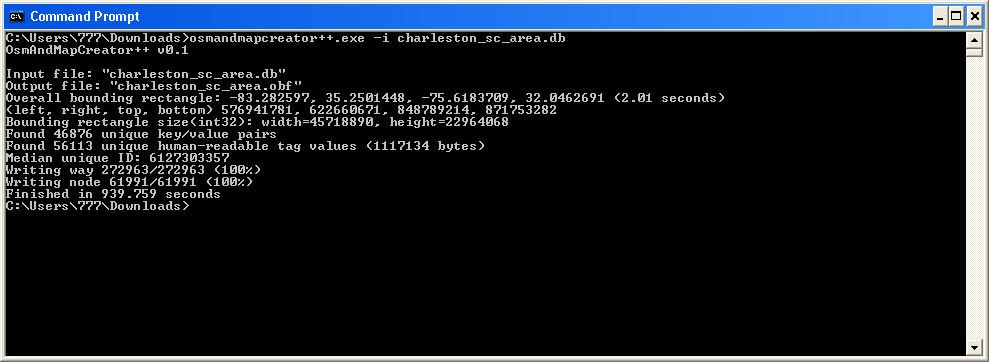
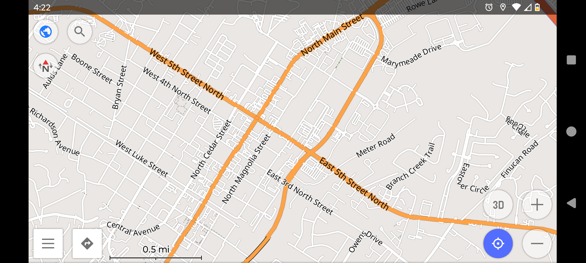

OsmAndMapCreator++
==================

OsmAndMapCreator++ is an unofficial utility that generates OsmAnd OBF maps from OpenStreetMap SQLite databases. It is written in C++ and designed to be small and efficient and support generating large areas like the entire southeast US as one map by reading everything from an SQLite database and storing temp files on the hard drive instead of trying to load everything in memory first like the official tool. Built with Clang 22.1.5 and Visual C++ 2017 and works on Windows XP x64 or higher

#### How to use
1. Download or generate an OSM PBF file. For example, you could use an extract from Geofabrik
2. Run **pbf2sqlite.exe \[database file\] read \[PBF file\] index rtree addr graph** to convert it to an SQLite database
3. (Recommended) Run the VACUUM SQL command to optimize the database
4. Run **osmandmapcreator++.exe** with "-i \[input file\]" and optionally "-o \[output file\]". You can also just drag a \*.db file onto the EXE

#### How to build
1. Install Visual Studio 2017 with the C++ build tools
2. Make sure clang-cl.exe is in your PATH
3. Open the "x64 Native Tools Command Prompt for VS 2017" and change to the repo folder
4. Run **build_clang_x64[_faster].bat** (the faster one only builds main.c)

#### Known issues
- Ways don't touch perfectly on the vector map. I believe this is caused by rounding errors since coordinates are stored as deltas with a granularity of 32 (the lower 5 bits are discarded)
- Large areas need to be split (everything is currently written as 1 data block)
- Add route and address indexes (currently it only generates vector maps)