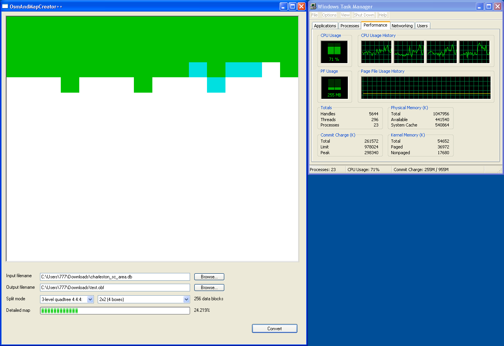
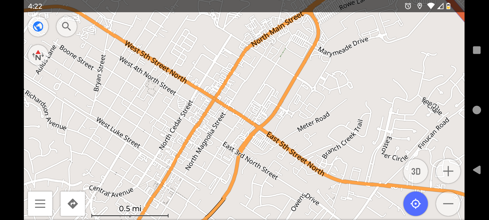
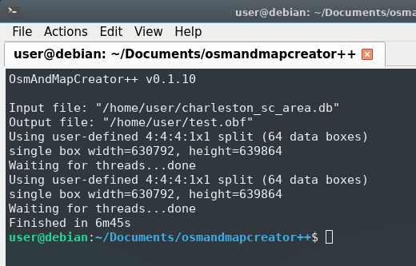

OsmAndMapCreator++
==================

OsmAndMapCreator++ is an unofficial utility that generates OsmAnd OBF maps from OpenStreetMap SQLite databases. It is written in C++ and designed to be small and efficient and support generating large areas like the entire southeast US as one map by reading everything from an SQLite database and storing temp files on the hard drive instead of trying to load everything in memory first like the official tool. Built with Clang 22.1.5 and Visual C++ 2017 and works on Windows XP x64 or higher

#### How to use
1. Download or generate an OSM PBF file. For example, you could use an extract from Geofabrik
2. Use my pbf2sqlite fork and run **pbf2sqlite64.exe \[database file\] read \[PBF file\] index rtree_all addr graph** to convert it to an SQLite database. The output should be around 24 times the size of the PBF file. My PBF file of the southeast US is 2.82 GiB and the vacuumed DB file is 67.28 GiB. You need to use my fork since it adds all nodes to the RTree and skips adding RTree entries for ways and nodes with null latitude and longitude values. The official version skips untagged nodes for the "rtree" option which breaks this program's bounding box searches and converts null coordinates to 0 which makes the bounding boxes huge so almost everything is in just a few boxes and you can't just filter that because then you would break areas that include the equator
3. (Recommended) Run the VACUUM SQL command to optimize the database. You can use VACUUM INTO if you need to use a 2nd drive
4. Run **osmandmapcreator++.exe** with "-i \[input file\]" and optionally "-o \[output file\]". You can also just drag a \*.db file onto the EXE

<br>Using all 4 cores on an Intel Core 2 Quad Q9550 in a VM with 1 GB of RAM







#### How to build on Windows
1. Install Visual Studio 2017 with the C++ build tools
2. Make sure clang-cl.exe is in your PATH
3. Open the "x64 Native Tools Command Prompt for VS 2017" and change to the repo folder
4. Run **build_clang_x64[_faster].bat** (the faster one only builds main.c)

#### How to build on Debian 13
Install the build environment
```
bash -c "$(wget -O - https://apt.llvm.org/llvm.sh)"
sudo update-alternatives --install /usr/bin/clang clang /usr/bin/clang-22 100
sudo update-alternatives --install /usr/bin/clang++ clang++ /usr/bin/clang++-22 100
sudo apt install libgtk-4-dev libprotobuf-dev
```

Build the program
```
./build[_faster].sh
```

#### Known issues
- Ways don't touch perfectly on the vector map. I believe this is caused by rounding errors since coordinates are stored as deltas with a granularity of 32 (the lower 5 bits are discarded)
- The bounding boxes probably need to be extended to overlap more
- Add route and address indexes (currently it only generates vector maps)